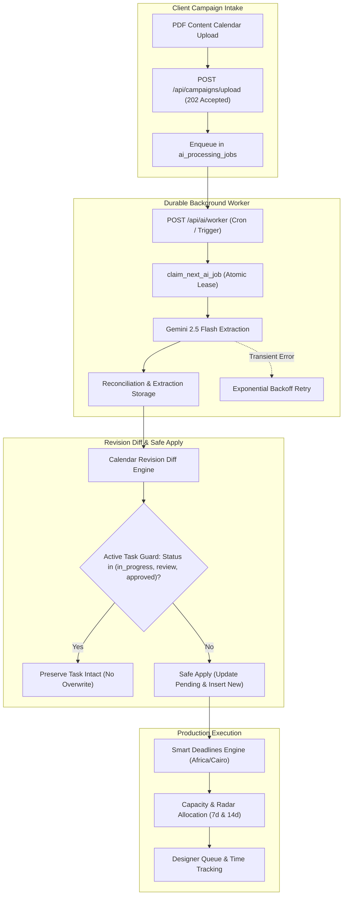

# OMG Creative Workspace — Agency Scale Blueprint
**Document Status:** Operational Architecture & Scale Blueprint (Live Production Baseline)  
**Effective Timezone:** Africa/Cairo (UTC+2 / UTC+3)  
**Production Domain:** https://omg-creative-workspace.vercel.app  
**Target Scale:** 10 → 50 → 200 Creative Professionals  

---

## 1. Executive Summary & Core Objectives

**OMG Creative Workspace** is built as a mission-critical operating system for high-velocity creative agencies. It automates and hardens the full lifecycle of client content campaigns:
1. **Durable Background AI Extraction**: Asynchronous PDF parsing and Gemini Flash analysis running in background jobs with lease locking, eliminating Vercel HTTP timeouts.
2. **Revision Diffing & Active Task Protection**: Intelligent versioning engine that detects added, changed, and removed posts while strictly protecting tasks already in progress or approved.
3. **Decoupled Smart Deadlines**: Separation of `design_due_date`, `review_due_date`, and `publish_at` anchored to Cairo business days (Sunday–Thursday).
4. **Capacity-Aware Workload Balancing**: Dynamic assignment engine that accounts for deliverable format weights and client difficulty multipliers to prevent designer burnout.
5. **Zero-Trust Multi-Tenant Security**: Role-based access control (RBAC), invitations paused safeguard, and strict database-level Row Level Security (RLS).

---

## 2. System Architecture & Workflows

---

## 3. Core Architectural Hardening Pillars

### 3.1 Durable Background Worker & Lease Locking
* **Upload Response**: `HTTP 202 Accepted` returned in <1.5s with `jobId` and `campaignId`.
* **Lease Acquisition**: Database RPC `claim_next_ai_job` atomically marks the job as `processing` and sets `locked_until = NOW() + INTERVAL '5 minutes'`.
* **Crash Recovery**: Orphaned jobs exceeding the lease duration are automatically recovered and reassigned.
* **Exponential Backoff**: Transient errors (e.g. rate limits, network blips) retry up to 3 times with exponential backoff ($15s, 30s, 60s$). Permanent errors (e.g. invalid credentials) fail immediately with Arabic diagnostics.
* **Cron Redundancy**: Vercel Cron runs every minute (`* * * * *`) targeting `/api/ai/worker` with `CRON_SECRET` bearer token authentication.

### 3.2 Calendar Revisions & Active Task Protection Guard
* **Revision Traceability**: Each campaign stores `revision_number` with partial unique indexing on the active revision.
* **Granular Diffing**: Field-by-field delta detection across: `post_order`, `post_number`, `title`, `caption`, `brief`, `platform`, `format`, `publish_date`, `design_due_date`, `slides`.
* **Active Task Invariant**: Any task with status in `['in_progress', 'review', 'approved', 'delivered']` is **never deleted or overwritten** by revision synchronization.
* **Atomic RPC**: `apply_calendar_revision_tasks` executes in a single PostgreSQL transaction with full audit logging.

### 3.3 Decoupled Smart Deadlines (Africa/Cairo)
* **Timezone Standard**: All dates processed in `Africa/Cairo` (UTC+2 standard / UTC+3 DST).
* **Egyptian Working Week**: Sunday through Thursday. Friday and Saturday are recognized weekends and skipped when computing business day offsets.
* **Timeline Separation**:
  - `publish_at`: Client scheduled publication date (default 18:00 Cairo time).
  - `review_due_date`: Internal art director/senior review milestone (1 Egyptian business day before publication at 14:00 Cairo time).
  - `design_due_date`: Designer delivery deadline (2 Egyptian business days prior for Static designs; 3 Egyptian business days prior for Heavy formats: Reels, Motion, Video, Carousels, or Hard difficulty clients).

### 3.4 Workload Balancing & Weight Formula
* **Deliverable Format Base Weights**:
  - Static Design: $1.0$
  - Carousel: $1.5 + 0.15 	imes 	ext{slides count}$
  - Reel / Motion Graphics / Video: $2.5$
* **Client Difficulty Multipliers**:
  - Easy: $0.9$
  - Medium: $1.0$
  - Hard: $1.2$
* **Load Score**:
  $$	ext{Weighted Load} = sum (	ext{Format Base Weight} 	imes 	ext{Difficulty Multiplier})$$
  $$	ext{Load Ratio} = minleft(100, rac{	ext{Weighted Load}}{	ext{Max Weighted Load Capacity}} 	imes 100
ight)$$
* **Utilization Thresholds**:
  - $< 60%$: Underutilized (Available capacity)
  - $60% - 90%$: Balanced (Optimal production throughput)
  - $> 90%$: Overloaded (High risk of burnout / delivery delays)

---

## 4. Multi-Tenant Security & Operations

### 4.1 Zero-Trust RBAC & Session Verification
* **All API Routes**: Protected via server-side session checks (`requireOwner`, `requireTaskAccess`, `requireWorkspaceMember`).
* **Origin Validation**: Strict same-origin header verification on all mutating routes (`POST`, `PATCH`, `DELETE`).
* **Invitations Safety Protocol**: `workspaces.invitations_paused = true` strictly enforced. The Invitations Center operates in internal **Draft Mode** only, ensuring zero unwanted external emails.

### 4.2 Comprehensive Audit Trail
* All critical actions automatically recorded in `public.audit_events`:
  - `transition_task_status`
  - `import_content_calendar_tasks`
  - `apply_calendar_revision`
  - `archive_task` / `restore_task`
  - `update_client_assignment`
  - `send_invitation`
* Direct CSV export with UTF-8 BOM encoding for complete Arabic script compatibility in Excel and Google Sheets.

---

## 5. Scaling Milestones (10 → 50 → 200 Creative Team)

| Milestone | Team Size | Active Clients | Architectural Scaling Strategies |
| :--- | :--- | :--- | :--- |
| **Stage 1 (Current)** | 7–15 | 28 | Single-tenant Supabase, Vercel Cron, Next.js App Router, Gemini Flash pipeline. |
| **Stage 2** | 20–50 | 75–100 | Dedicated background worker runner, Redis-based queue cache, automated client approval portal tokens. |
| **Stage 3** | 50–200 | 250+ | Read replicas for analytics, dedicated media processing cluster, automated video frame annotations. |

---

## 6. Conclusion
With durable background processing, atomic revision management, decoupled smart deadlines, and zero-trust security live in production, **OMG Creative Workspace** provides an unbreakable operational foundation ready for multi-discipline agency scale.
