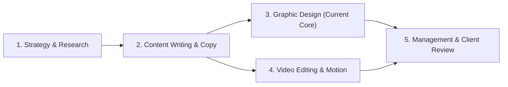

# OMG Creative Workspace — Agency Scale Blueprint
**Document Status:** Architectural Specification (Future Horizon)  
**Target Scope:** Cross-Discipline Agency Scaling  
**Effective Framework:** Pure Specification — Zero Premature Database Entities  

---

## 1. Executive Summary

**OMG Creative Workspace** is currently established with a high-durability operational foundation centered on **Graphic Design, Content Calendars, AI Document Extraction, and Workload Balancing**.

As the agency scales, five key creative and operational disciplines will integrate into the workspace. This blueprint specifies the architectural boundaries, entity relationships, and pipeline interfaces to ensure that future expansions plug seamlessly into the existing schema (`workspaces`, `clients`, `campaigns`, `roster_people`, `tasks`) without breaking changes or premature table bloat.

---

## 2. The 5 Core Disciplines & Workflow Lifecycles

### 2.1 Strategy & Market Research
* **Scope**: Brand voice guidelines, audience persona definitions, competitors analysis, and monthly strategic pillars.
* **Input**: Client onboarding brief, market insights, and historical campaign performance.
* **Output**: Strategic content pillar documents linked to monthly campaigns (`campaigns.month_key`).
* **Integration Boundary**: 
  - Attaches to `campaigns` via `strategy_brief` metadata.
  - Generates recommended post distribution ratios (e.g., 40% Educational, 30% Proof/Results, 30% Promotional).

### 2.2 Content Writing & Copywriting
* **Scope**: Ideation, hooks development, long-form captions, hashtags, and reel scripts.
* **Input**: Content pillars and calendar scheduling briefs.
* **Output**: Textual blueprints that populate `content_calendar_items` (`hook`, `caption`, `reel_script`, `cta`, `slides`).
* **Integration Boundary**:
  - Writers draft directly within `content_calendar_items` before PDF generation or AI extraction.
  - Tone-of-voice validation via Gemini LLM against the client's brand guidelines.

### 2.3 Graphic Design & Visual Operations (Current Live System)
* **Scope**: Static designs, multi-slide carousels, cover art, and typographic styling.
* **Input**: Approved content calendar items with on-design text and slide breakdowns.
* **Output**: Deliverable task artifacts, image exports, and Figma/Photoshop source assets.
* **Integration Boundary**:
  - Direct 1-to-1 traceability via `tasks.content_calendar_item_id`.
  - Workload scoring: $1.0$ Static, $1.5 + 0.15 \times \text{slides}$ Carousel, multiplied by client difficulty.

### 2.4 Video Production & Motion Graphics
* **Scope**: Reels, TikToks, motion graphics animations, voiceovers, and sound design.
* **Input**: Reel scripts, audio voiceover assets, and visual storyboards.
* **Output**: MP4 video deliverables with timestamped review markers.
* **Integration Boundary**:
  - Video tasks use `deliverable_format = 'Reel' | 'Motion'` with base weight $2.5$.
  - Future timestamped comment annotations on video player timecodes.

### 2.5 Executive Management & Client Servicing
* **Scope**: Capacity forecasting, designer burnout prevention, client retention, and review approvals.
* **Input**: Aggregate metrics from `tasks`, `task_status_events`, and `audit_events`.
* **Output**: Agency throughput reports, difficulty adjustments, and SLA adherence dashboards.
* **Integration Boundary**:
  - Read-only real-time views pulling from existing `member_capacities` and `workspaces.invitations_paused`.

---

## 3. Data Architecture Evolution Strategy

### 3.1 Guiding Principles for Future Schema Expansion
1. **Never Add Empty Schema**: New tables must only be created in Supabase alongside production-ready UI components and server actions.
2. **Preserve Roster Person Separation**: All future roles (Strategist, Copywriter, Video Editor, Account Manager) belong to `public.roster_people` with role-based policies.
3. **Unified Audit Trail**: All status transitions, assignment changes, and review approvals continue to feed into `public.audit_events`.

### 3.2 Planned Future Entity Interfaces (When Ready for Implementation)
* `brand_guidelines`: Structured tone, colors, typography, and do's/don'ts per client.
* `video_review_frames`: Timestamped frame notes ($00:15$) for motion designers.
* `client_portal_tokens`: Secure client-facing review sessions with expiration and watermark guards.

---

## 4. Conclusion
By hardening the designer operations, AI job durability, version diffing, and invitation security in the current release, **OMG Creative Workspace** is architecturally primed to scale into a multi-discipline creative powerhouse without technical debt.
